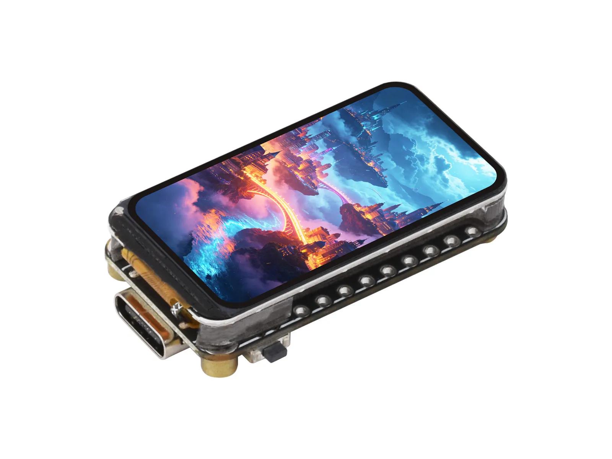

# Waveshare ESP32-C5-LCD-1.47

[中文](README_CN.md)

ESP32-C5-LCD-1.47 is a compact development board built around the
ESP32-C5 with 4 MB embedded Flash. It integrates a 1.47-inch 172 x 320 ST7789
SPI LCD, a microSD slot, and one WS2812B RGB LED. It has no onboard touch
controller, audio codec, RTC, I/O expander, or PSRAM. The official product page
and checked-in schematic disagree on the chip suffix (`ESP32-C5FH4` versus
`ESP32-C5HF4`); see the hardware reference instead of inferring a variant from
one source. The ESP32-C5 provides Wi-Fi 6, Bluetooth LE, and IEEE 802.15.4 radio
capabilities; this repository currently includes a Wi-Fi scan example but no
Bluetooth or 802.15.4 example.

- [Purchase Link](https://www.waveshare.com/shop/ESP32-C5-LCD-1.47.htm)
- [Product Documentation](https://docs.waveshare.com/ESP32-C5-LCD-1.47/)
- [Hardware Reference](HARDWARE_REFERENCE.md)

## Repository Contents

The repository contains eight matching ESP-IDF and Arduino examples, vendored
Arduino display libraries, factory recovery firmware, schematics, and
mechanical drawings.

| Example | Purpose |
| --- | --- |
| `01_lcd_panel_basic` | ST7789 display initialization and direct drawing |
| `02_lvgl_hello` | LVGL display integration |
| `03_backlight_fade` | LCD backlight PWM |
| `04_ws2812_rgb` | Onboard RGB LED |
| `05_sdcard_rw` | microSD read/write over shared SPI |
| `06_spiffs_rw` | SPIFFS read/write |
| `07_wifi_scan` | Wi-Fi network scan |
| `08_board_showcase` | Integrated board self-test |

Direct projects live in `examples/esp-idf/` and `examples/arduino/`. Arduino
libraries live separately in the repository-root `libraries/` directory.

## Build Configuration

ESP-IDF projects target `esp32c5` and use their local `sdkconfig.defaults`.
Arduino builds must include `--libraries libraries`; the complete tested FQBN,
Arduino CLI version, Arduino-ESP32 version, and ESP-IDF versions are stored in
`config/ci.json`.

GitHub Actions discovers all examples and builds a 24-item release matrix:
eight projects on each of two ESP-IDF versions plus eight Arduino sketches.
Stable `vMAJOR.MINOR.PATCH` tags can publish a GitHub Release only after every
build succeeds and every ZIP is matched to the tag commit. See
[Continuous Integration](docs/ci.md) and [Firmware](docs/firmware.md).

## Documentation

- [Hardware Reference](HARDWARE_REFERENCE.md)
- [Repository Structure](docs/repository-structure.md)
- [Components](docs/components.md)
- [Firmware Archives](releases/README.md)
- [Contributing](CONTRIBUTING.md)
- [Support](SUPPORT.md)
- [Security Policy](SECURITY.md)

## License

Project-specific files are licensed under the Apache License 2.0. Third-party
libraries under `libraries/` retain their original licenses; check each
library's metadata and license files.
